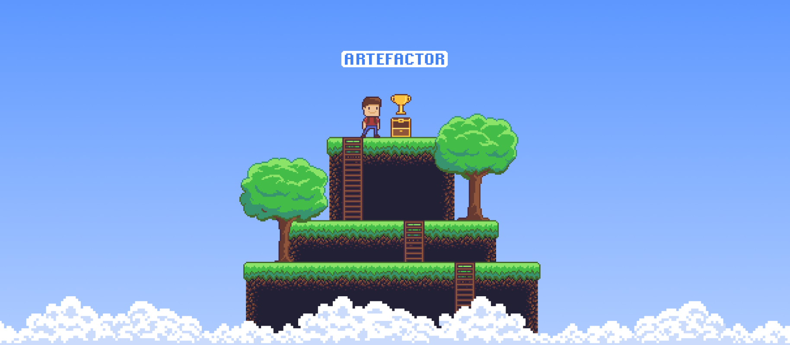

<p align="center"><a href="#readme"></a></p>

<p align="center">
  <a href="https://kaos.sh/w/artefactor/ci"></a>
  <a href="https://kaos.sh/l/artefactor"></a>
  <a href="https://kaos.sh/w/artefactor/codeql"></a>
  <a href="#license"></a>
</p>

<p align="center"><a href="#usage-demo">Usage demo</a> • <a href="#installation">Installation</a> • <a href="#usage">Usage</a> • <a href="#ci-status">CI Status</a> • <a href="#contributing">Contributing</a> • <a href="#license">License</a></p>

<br/>

`artefactor` is utility for downloading artefacts from GitHub.

### Usage demo

[](#usage-demo)

### Installation

#### From source

To build the `artefactor` from scratch, make sure you have a working Go 1.23+ workspace (_[instructions](https://go.dev/doc/install)_), then:

```bash
go install github.com/essentialkaos/artefactor@latest
```

#### Prebuilt binaries

You can download prebuilt binaries for Linux from [EK Apps Repository](https://apps.kaos.st/artefactor/latest):

```bash
bash <(curl -fsSL https://apps.kaos.st/get) artefactor
```

### Usage


### CI Status

| Branch | Status |
|--------|----------|
| `master` | [](https://kaos.sh/w/artefactor/ci?query=branch:master) |
| `develop` | [](https://kaos.sh/w/artefactor/ci?query=branch:develop) |

### Contributing

Before contributing to this project please read our [Contributing Guidelines](https://github.com/essentialkaos/contributing-guidelines#contributing-guidelines).

### License

[Apache License, Version 2.0](http://www.apache.org/licenses/LICENSE-2.0)

<p align="center"><a href="https://essentialkaos.com"></a></p>
